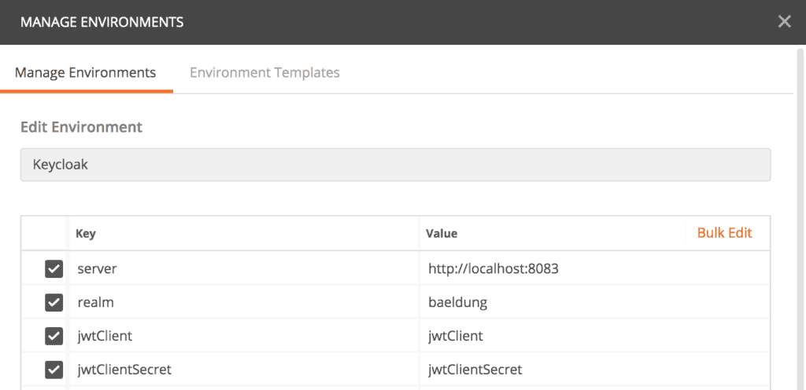
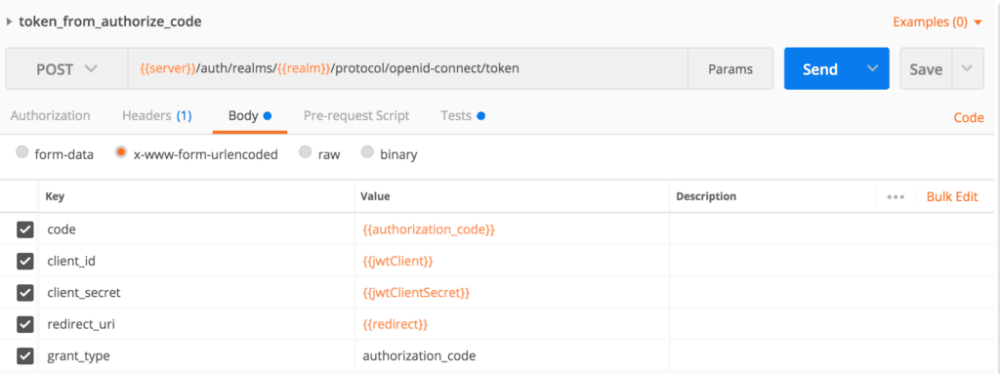
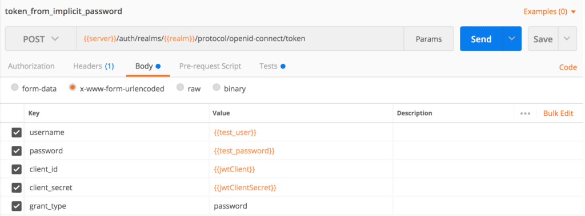

# [使用Postman访问Keycloak端点](https://www.baeldung.com/postman-keycloak-endpoints)

1. 绪论

    在本教程中，我们将首先快速回顾一下OAuth 2.0、OpenID和Keycloak。然后，我们将了解Keycloak的REST APIs以及如何在Postman中调用它们。

2. OAuth 2.0

    [OAuth 2.0](https://tools.ietf.org/html/rfc6749)是一个授权框架，允许经过认证的用户通过令牌向第三方授予访问权。令牌通常被限制在一些范围内，并有有限的使用寿命。因此，它是用户凭证的一个安全替代方案。

    OAuth 2.0有四个主要组成部分。

    - 资源所有者(Resource Owner)--拥有受保护资源或数据的终端用户或系统
    - 资源服务器(Resource Server)--通常通过基于 HTTP 的 API 公开受保护资源的服务
    - 客户端(Client)--代表资源所有者调用受保护的资源
    - 授权服务器(Authorization Server)--签发 OAuth 2.0 令牌，并在对资源所有者进行身份验证后将其发送给客户端

    OAuth 2.0是一个具有[一些标准流程的协议](https://auth0.com/docs/protocols/protocol-oauth2)，但我们在这里对授权服务器组件特别感兴趣。

3. 开放身份连接

    OpenID Connect 1.0 ([OIDC](https://openid.net/connect/))建立在OAuth 2.0之上，为该协议添加了一个身份管理层。因此，它允许客户通过标准的OAuth 2.0流程验证最终用户的身份并访问基本的配置文件信息。OIDC已经[为OAuth 2.0引入了一些标准作用域](https://www.baeldung.com/spring-security-openid-connect)，如openid、profile和email。

4. Keycloak作为授权服务器

    JBoss已经开发了Keycloak，作为一个基于Java的开源身份和访问管理解决方案。除了支持OAuth 2.0和OIDC之外，它还提供了身份经纪、用户联盟和SSO等功能。

    我们可以将Keycloak作为一个带有管理控制台的[独立服务器](https://www.baeldung.com/spring-boot-keycloak)或将其[嵌入Spring应用程序](https://www.baeldung.com/keycloak-embedded-in-spring-boot-app)中。一旦我们的Keycloak以上述任何一种方式运行，我们就可以尝试端点。

5. Keycloak端点

    Keycloak为OAuth 2.0流暴露了各种REST端点。

    为了在Postman中使用这些端点，我们将首先创建一个名为”Keycloak.“的环境，然后为Keycloak授权服务器URL、领域、OAuth 2.0客户端ID和客户端密码添加一些键/值条目。

    

    最后，我们将创建一个集合，在这里我们可以组织我们的Keycloak测试。现在我们准备探索可用的端点。

    1. OpenID配置端点

        配置端点就像根目录。它返回所有[其他可用的端点、支持的作用域和索赔以及签名算法](https://www.baeldung.com/spring-security-openid-connect)。

        让我们在Postman中创建一个请求：`{{server}}/auth/realms/{{realm}}/.welliced/openid-configuration`，Postman在运行时从选定的环境中设置`{{server}}`和`{{realm}}`的值：。

        然后我们将执行请求，如果一切顺利，我们将得到一个响应。

        ```json
        {
            "issuer": "http://localhost:8083/auth/realms/baeldung",
            "authorization_endpoint": "http://localhost:8083/auth/realms/baeldung/protocol/openid-connect/auth",
            "token_endpoint": "http://localhost:8083/auth/realms/baeldung/protocol/openid-connect/token",
            "token_introspection_endpoint": "http://localhost:8083/auth/realms/baeldung/protocol/openid-connect/token/introspect",
            "userinfo_endpoint": "http://localhost:8083/auth/realms/baeldung/protocol/openid-connect/userinfo",
            "end_session_endpoint": "http://localhost:8083/auth/realms/baeldung/protocol/openid-connect/logout",
            "jwks_uri": "http://localhost:8083/auth/realms/baeldung/protocol/openid-connect/certs",
            "check_session_iframe": "http://localhost:8083/auth/realms/baeldung/protocol/openid-connect/login-status-iframe.html",
            "grant_types_supported": [...],
            ...
            "registration_endpoint": "http://localhost:8083/auth/realms/baeldung/clients-registrations/openid-connect",
            ...
            "introspection_endpoint": "http://localhost:8083/auth/realms/baeldung/protocol/openid-connect/token/introspect"
        }
        ```

        如前所述，我们可以在响应中看到所有可用的端点，如”authorization_endpoint,” “token_endpoint,“等等。

        此外，响应中还有其他有用的属性。例如，我们可以从”grant_types_supported“中找出所有支持的授予类型，或从”scopes_supported.“中找出所有支持的作用域。

    2. 授权端点

        让我们继续我们的旅程，负责[OAuth 2.0授权代码流](https://auth0.com/docs/flows/authorization-code-flow)的authorize端点。它在OpenID配置响应中作为“authorization_endpoint”可用。

        端点是：。

        `{{server}}/auth/realms/{{realm}}/protocol/openid-connect/auth?response_type=code&client_id=jwtClient`

        此外，该端点接受scope和redirect_uri作为可选参数。

        我们不会在Postman中使用这个端点。相反，我们通常通过浏览器启动授权代码流。然后，如果没有有效的登录cookie，Keycloak会将用户重定向到一个登录页面。最后，授权码被传递到重定向的URL。

        接下来我们将看到如何获得一个访问令牌。

    3. 令牌端点

        令牌端点允许我们检索访问令牌、刷新令牌或ID令牌。OAuth 2.0支持不同的授予类型，如authorization_code,refresh_token，或password。

        令牌的端点是：`{{server}}/auth/realms/{{realm}}/protocol/openid-connect/token`

        不过，每种授权类型都需要一些专用的表单参数。

        我们将首先测试我们的令牌端点，为我们的授权代码获得一个访问令牌。我们必须在请求体中传递这些表单参数。client_id, client_secret, grant_type, code, 和redirect_uri。令牌端点还接受scope作为一个可选参数。

        

        如果我们想绕过授权代码流程，可以选择密码授予类型。在这里，我们需要用户凭据，因此可以在网站或应用程序上有内置登录页面时使用此流程。

        让我们创建一个Postman请求，并在正文中传递表单参数client_id、client_secret、grant_type、username和password。

        

        在执行这个请求之前，我们必须将用户名和密码变量添加到Postman的环境键/值对。

        另一个有用的授予类型是 refresh_token。当我们从先前对令牌端点的调用中获得一个有效的刷新令牌时，我们可以使用它。刷新令牌流程需要参数client_id、client_secret、grant_type和refresh_token。

        我们需要响应access_token来测试其他端点。为了加快我们用Postman进行测试的速度，我们可以在令牌端点请求的Tests部分写一个脚本。

        ```sh
        var jsonData = JSON.parse(responseBody);
        postman.setEnvironmentVariable("refresh_token", jsonData.refresh_token);
        postman.setEnvironmentVariable("access_token", jsonData.access_token);
        ```

    4. 用户信息端点

        当我们有一个有效的访问令牌时，我们可以从用户信息端点检索用户资料数据。

        用户信息端点可在：`{{server}}/auth/realms/{{realm}}/protocol/openid-connect/userinfo`

        现在我们将为它创建一个Postman请求，并在Authorization头中传递访问令牌。

        然后，我们将执行请求。下面是成功的响应。

        ```json
        {
            "sub": "a5461470-33eb-4b2d-82d4-b0484e96ad7f",
            "preferred_username": "john@test.com",
            "DOB": "1984-07-01",
            "organization": "baeldung"
        }
        ```

    5. 令牌Introspect端点

        如果资源服务器需要验证访问令牌是否处于活动状态，或需要更多有关访问令牌的元数据，特别是对于[不透明访问令牌](https://auth0.com/docs/tokens/access-tokens)，那么令牌内省端点就是答案。在这种情况下，资源服务器会将自省过程与[安全配置](https://www.baeldung.com/spring-security-oauth-resource-server)整合在一起。

        我们将调用Keycloak的inrospect端点：`{{server}}/auth/realms/{{realm}}/protocol/openid-connect/token/introspect`

        然后我们将在Postman中创建一个内省请求，并将client_id、client_secret和token作为表单参数。

        如果access_token是有效的，那么我们将得到我们的响应。

        ```json
        {
            "exp": 1601824811,
            "iat": 1601824511,
            "jti": "d5a4831d-7236-4686-a17b-784cd8b5805d",
            "iss": "http://localhost:8083/auth/realms/baeldung",
            "sub": "a5461470-33eb-4b2d-82d4-b0484e96ad7f",
            "typ": "Bearer",
            "azp": "jwtClient",
            "session_state": "96030af2-1e48-4243-ba0b-dd4980c6e8fd",
            "preferred_username": "john@test.com",
            "email_verified": false,
            "acr": "1",
            "scope": "profile email read",
            "DOB": "1984-07-01",
            "organization": "baeldung",
            "client_id": "jwtClient",
            "username": "john@test.com",
            "active": true
        }
        ```

        然而，如果我们使用无效的访问令牌，那么响应将是。

        ```json
        {
            "active": false
        }
        ```

6. 结语

    在这篇文章中，通过运行Keycloak服务器，我们为授权、令牌、用户信息和反省端点创建了Postman请求。
